# PRODUCT REQUIREMENT DOCUMENT (PRD) & ARSITEKTUR SISTEM
## Sistem Informasi Koperasi & Bank Sampah "Koperasi Jasa Mulyo Raharjo Lestari"
**Arsitektur:** Web Service (Laravel RESTful API + Sanctum) & Client SPA (React + Tailwind CSS)  
**Versi:** 2.0.0  
**Tanggal:** 4 September 2026  
**Status:** Approved Blueprint for Multi-Developer Team  

---

## 1. Ringkasan Eksekutif & Domain Bisnis

Koperasi Jasa Mulyo Raharjo Lestari menjalankan dua pilar aktivitas yang terintegrasi secara finansial dan operasional:
1. **Layanan Jasa Keuangan & Simpan Pinjam Koperasi**: Mengelola simpanan anggota (Pokok, Wajib, Sukarela), iuran layanan bulanan (Tipping Fee pengangkutan), serta pembagian Sisa Hasil Usaha (SHU) tahunan.
2. **Layanan Bank Sampah & Logistik Pengangkutan**: Mengelola penjemputan sampah warga/anggota dari rumah/pasar/gudang, penimbangan presisi berdasarkan kategori harga dinamis (Organik, Campur, Anorganik), serta konversi langsung hasil timbangan menjadi **saldo tunai anggota (langsung cair/real-time)**.

### Hubungan Finansial Kunci (Closed-Loop Economy)
- **Potongan Admin 20%**: Setiap transaksi penjualan sampah anggota ke pengepul dikenakan potongan administrasi koperasi sebesar **20%**.
- **Pool Dana SHU**: Akumulasi potongan 20% inilah yang menjadi sumber pendapatan operasional koperasi dan dialokasikan ke pool cadangan SHU tahunan (20% dari laba bersih dibagikan kembali secara proporsional ke anggota di akhir tahun).

---

## 2. Arsitektur Solusi & Tech Stack (Web Service Concept)

Sistem dibangun dengan pemisahan tegas (*separation of concerns*) antara **Backend API Service** dan **Frontend Client Application** guna memudahkan pembagian kerja tim teknis:

```mermaid
graph TD
    subgraph Frontend Client [React 18 SPA / Vite Client]
        UI_Admin[Admin/Pengurus Portal]
        UI_Officer[Petugas/Pengepul Mobile Web]
        UI_Member[Portal Anggota/Warga]
        State[State Management / TanStack Query & Zustand]
        Axios[HTTP Client Axios + Interceptors]
    end

    subgraph Backend Web Service [Laravel 11 RESTful API]
        Gateway[API Gateway / CORS / Rate Limiter]
        Sanctum[Auth Guard: Laravel Sanctum Token]
        Controllers[API Controllers v1]
        Services[Business Logic & Service Layer]
        Policies[RBAC Authorization Policies]
        Jobs[Queues & Scheduler / SHU Engine]
    end

    subgraph Data Store [Persistence Layer]
        MySQL[(MySQL 8.0 Relational DB)]
        Storage[(Local / S3 Storage: Bukti & Nota)]
    end

    UI_Admin --> Axios
    UI_Officer --> Axios
    UI_Member --> Axios
    Axios -->|JSON over HTTPS + Bearer Token| Gateway
    Gateway --> Sanctum
    Sanctum --> Policies
    Policies --> Controllers
    Controllers --> Services
    Services --> MySQL
    Services --> Storage
    Jobs --> MySQL
```

### Komponen Teknologi:
- **Backend Service (API Engine)**: Laravel 11 (PHP 8.3), Laravel Sanctum (Token-based SPA/Mobile Auth), Eloquent ORM, Form Request Validation, API Resources (JSON Transformation).
- **Frontend Client (UI Layer)**: React 18, Vite/Inertia React SPA, Tailwind CSS v3/v4, Headless UI, Lucide Icons, TanStack Query (React Query) / Axios.
- **Basis Data**: MySQL 8.0 dengan InnoDB engine, Foreign Key Constraints, Indexed Query.

---

## 3. Matriks Peran Pengguna (RBAC Matrix)

Sistem mendukung 4 tingkatan peran pengguna dengan izin akses terstandarisasi:

| Modul / Fitur | Admin / Pengurus | Bendahara / Operator Keuangan | Pengepul / Petugas Lapangan | Anggota / Warga |
|---|:---:|:---:|:---:|:---:|
| **Master Data (User & Anggota)** | Full CRUD | View Only | View Assigned | View Profile Sendiri |
| **Katalog & Harga Sampah** | Full CRUD | Update Harga Harian | View (Read Only) | View Papan Info |
| **Input Timbang & Jemput Sampah** | View / Koreksi | View | Create / Input Real-time | View Nota Sendiri |
| **Simpanan & Tipping Fee** | Full CRUD | Verifikasi & Catat Kas | No Access | Riwayat & Status Bayar |
| **Manajemen Saldo & Pencairan** | Approval | Approval & Eksekusi Bayar | No Access | Tarik Saldo / Riwayat |
| **Kalkulasi & Distribusi SHU** | Approval Akhir | Setup Draft & Hitung | No Access | Klaim & Riwayat SHU |
| **Pengaduan & Komplain Transaksi** | Resolusi / Closing | Resolusi Finansial | View Terkait | Create Komplain |
| **Laporan & Audit Log** | Full Laporan | Laporan Kas & Mutasi | Riwayat Setoran Hari Ini | Export Nota Digital |

---

## 4. Rincian Fungsional per Modul (Functional Specifications)

### 4.1 Modul Autentikasi & Akun
- **Auth Endpoint**: `POST /api/v1/auth/login`, `POST /api/v1/auth/logout`, `GET /api/v1/auth/me`.
- Autentikasi menggunakan personal access token (Sanctum) dengan masa berlaku yang aman.
- Mendukung pemulihan kata sandi, pengaturan profil, dan registrasi mandiri anggota baru.

### 4.2 Modul Keanggotaan (Membership)
- Kode Anggota otomatis berformat: `MBR-{YYYY}{MM}-{4 DIGIT RANDOM/URUT}`.
- Status anggota: `aktif`, `nonaktif`, `suspend`.
- Klasifikasi member: Anggota Biasa, Anggota Inti, Pengurus.

### 4.3 Modul Simpanan & Tipping Fee
- **Simpanan Pokok**: Rp50.000 (1x saat pendaftaran, wajib tuntas).
- **Simpanan Wajib**: Rp5.000/bulan.
- **Tipping Fee (Biaya Angkut)**: Rp40.000/bulan.
- **Total Tagihan Rutin Bulanan**: Rp45.000/bulan.
- **Simpanan Sukarela**: Nominal bebas sewaktu-waktu.
- Fitur billing generator otomatis setiap awal bulan, sistem reminder otomatis, dan rekapitulasi tunggakan iuran.

### 4.4 Modul Bank Sampah, Katalog Harga & Transaksi Timbang
- **Struktur Harga Sampah**:
  - Sampah Campur: Rp300/kg.
  - Organik: Rp500/kg.
  - Anorganik: Terpilah multi-kategori (Logam, Besi, Kertas, Plastik/Atom, Elektronik/Lain-lain).
  - Satuan ganda: per Kilogram (`/kg`) dan per Satuan/Biji (`/biji` atau `/unit`).
  - Penyesuaian Lokasi:
    - Diantar ke gudang: Harga standar katalog penuh.
    - Dijemput di rumah/pasar: Pengurangan biaya logistik (−Rp300/kg non-logam, −Rp2.000/kg logam).
- **Mekanisme Timbang Lapangan (Mobile-Friendly)**:
  - Petugas memilih nama/kode anggota (QR Scanner / Auto-complete).
  - Memasukkan kategori item, kuantitas/berat, dan tipe penimbangan (antar gudang vs jemput).
  - Potongan administrasi koperasi 20% dihitung otomatis:
    $$\text{Gross Value} = \text{Berat} \times \text{Harga}$$
    $$\text{Admin Fee (20\%)} = \text{Gross Value} \times 0.20$$
    $$\text{Net to Member} = \text{Gross Value} - \text{Admin Fee}$$
  - Saldo anggota bertambah secara instan (*real-time update*).
  - Terbit **Nota Digital** dengan UUID unik dan QR Code verifikasi.

### 4.5 Modul Komplain & Dispute Transaksi
- Anggota dapat mengklik "Ajukan Komplain" pada transaksi timbangan maksimal 3x24 jam setelah transaksi.
- Alasan komplain: Selisih berat timbangan, salah kategori sampah, atau harga tidak sesuai.
- Status komplain: `diajukan`, `sedang_ditinjau`, `diterima` (revisi saldo), `ditolak`.

### 4.6 Modul Saldo, Pencairan & SHU (Sisa Hasil Usaha)
- **Agregasi Saldo Dompet Anggota**:
  $$\text{Saldo Akhir} = \sum \text{Setoran Sampah Net} + \sum \text{SHU Diterima} + \sum \text{Simpanan Sukarela} - \sum \text{Pencairan Tunai}$$
- **Kalkulasi SHU Tahunan**:
  - Dihitung dari 20% Laba Bersih Koperasi periode 1 Januari s/d 31 Desember.
  - Proporsi SHU:
    1. Jasa Modal (Simpanan Pokok + Simpanan Wajib + Simpanan Sukarela).
    2. Jasa Anggota/Partisipasi Usaha (Total frekuensi dan omset setoran sampah).
  - Eksekusi pembagian otomatis mengkredit saldo anggota dan mencatat mutasi kas keluar koperasi.
- **Pencairan Saldo (Withdrawal)**:
  - Fleksibel / Pluggable: Tunai di kantor kas, Transfer Bank (BCA, BRI, Mandiri), atau E-Wallet (GoPay, DANA).

---

## 5. Skema Relasi Basis Data (13 Core Tables + Audit)

1. `users`: Autentikasi, login credentials, role (`ketua`, `pengurus`, `petugas`, `anggota`).
2. `member_categories`: Master kategori keanggotaan.
3. `members`: Profil lengkap anggota, biodata, relasi ke user dan kategori.
4. `trash_categories`: Master katalog sampah, harga gudang vs jemput, satuan (`kg`, `biji`), status aktif.
5. `finance_categories`: Chart of accounts untuk pencatatan debit/kredit keuangan koperasi.
6. `setoran_koperasi`: Mutasi simpanan pokok, wajib, sukarela, dan tipping fee.
7. `detail_pengangkutan`: Log operasional logistik ritase armada pengangkutan per RT/RW/Dusun.
8. `pickups`: Header transaksi penjemputan sampah lapangan.
9. `pickup_items`: Rincian baris timbangan sampah per pickup (kategori, berat/unit, gross, fee 20%, net).
10. `transactions`: Jurnal buku besar keuangan kas koperasi (pemasukan/pengeluaran).
11. `shu_distributions`: Periode buku tahunan SHU, total laba, total alokasi, status draft/posted.
12. `shu_members`: Alokasi nominal dividen SHU per anggota.
13. `reports`: Dokumen arsip laporan periodik yang telah difinalisasi.
14. `complaints` *(Audit Extension)*: Pengaduan transaksi timbangan dari anggota.

---

## 6. Spesifikasi Desain Antarmuka & Frontend Guidelines

- **Responsif Mobile-First untuk Petugas Lapangan**: Interface penimbangan dirancang dengan tombol keypad besar, input minimalis, dan indikator konektivitas offline-ready dasar.
- **Papan Info Harga Sampah Transparan**: Halaman publik dan dashboard anggota menampilkan ticker harga terkini, perubahan harga harian (kenaikan/penurunan harga), dan filter kategori.
- **Desain Modern Premium**:
  - Color Palette: Forest Green / Emerald (`#059669`), Navy Slate (`#0f172a`), Clean White & Muted Grey.
  - Tipografi: Inter / Plus Jakarta Sans.
  - Micro-interactions: Feedback notifikasi toast real-time saat timbangan berhasil disimpan atau saldo bertambah.
