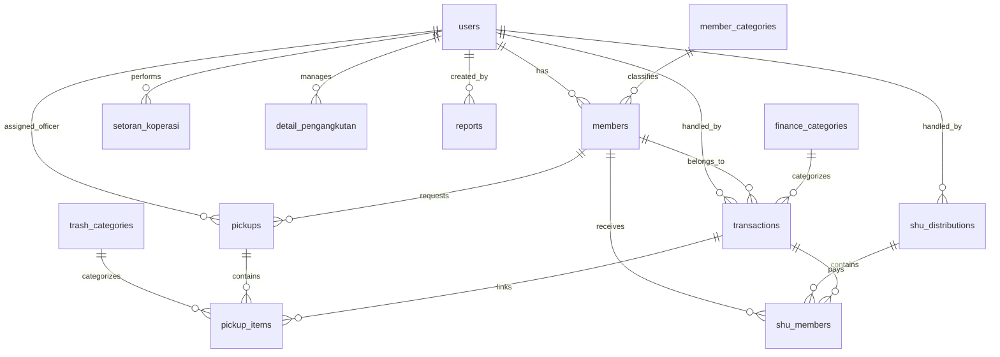
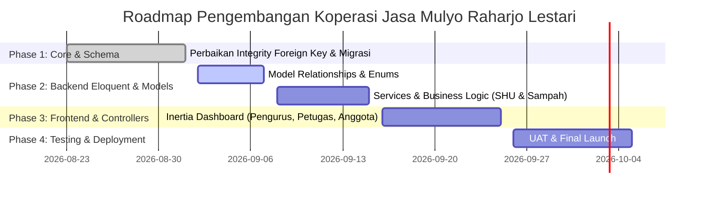

# Product Requirement Document (PRD)
## Sistem Informasi Koperasi & Bank Sampah - Koperasi Jasa Mulyo Raharjo Lestari

---

### 1. Informasi Dokumen & Metadata
- **Nama Produk:** Sistem Informasi Koperasi & Bank Sampah Jasa Mulyo Raharjo Lestari
- **Versi Dokumen:** 1.0.0
- **Tanggal:** 1 September 2026
- **Status:** Approved / Fixed Baseline
- **Tech Stack Utama:** Laravel 11 (PHP 8.2+), Inertia.js (React), Tailwind CSS, MySQL

---

### 2. Ringkasan Eksekutif & Latar Belakang

**Koperasi Jasa Mulyo Raharjo Lestari** mengintegrasikan dua fungsi bisnis utama:
1. **Koperasi Simpan Pinjam / Jasa Keuangan**, yang mengelola simpanan anggota (Pokok, Wajib, Sukarela, Tipping Fee, SHU) dan transaksi operasional keuangan.
2. **Bank Sampah & Layanan Pengangkutan**, yang mengelola penjemputan sampah warga/anggota, pemilahan (organik vs anorganik, terpilah vs tidak terpilah), penimbangan, serta konversi nilai sampah menjadi saldo/transaksi keuangan.

Sistem Web Application ini dibangun untuk menyediakan platform terpadu dan transparan bagi Pengurus, Petugas lapangan, serta Anggota Koperasi.

---

### 3. Tujuan Produk & Indikator Keberhasilan (OKRs)

#### 3.1 Tujuan Utama
- Digitalisasi pencatatan setoran simpanan dan pengangkutan sampah secara realtime.
- Otomasi perhitungan konversi sampah terpilah/tidak terpilah ke saldo transaksi anggota.
- Pengelolaan alokasi dan pembagian **Sisa Hasil Usaha (SHU)** berbasis kontribusi simpanan dan partisipasi transaksi anggota.
- Penyediaan laporan keuangan (Saldo, Laba Rugi, Simpanan, Operasional) yang akurat.

#### 3.2 Indikator Keberhasilan (KPI)
- Zero data mismatch antara transaksi fisik penjemputan sampah dan pencatatan keuangan.
- Efisiensi waktu penginputan timbangan & jadwal angkut oleh petugas di lapangan.
- Transparansi 100% pada rincian perolehan SHU tahunan per anggota.

---

### 4. Struktur Pengguna & Hak Akses (User Roles & Permissions)

Aplikasi mengimplementasikan **Role-Based Access Control (RBAC)** berdasarkan 4 peran utama pengguna:

| Role | Deskripsi Hak Akses |
| :--- | :--- |
| **Ketua** | Akses penuh ke seluruh sistem, persetujuan/finalisasi laporan keuangan, pembagian SHU, dan manajemen pengurus/petugas. |
| **Pengurus** | Mengelola master data (kategori anggota, kategori sampah, kategori keuangan), memproses transaksi keuangan, menyusun draft SHU, dan membuat laporan keuangan. |
| **Petugas** | Akses modul operasional lapangan: melihat jadwal angkut sampah, memasukkan data pengangkutan/timbangan, dan mengelola item penjemputan (*pickups*). |
| **Anggota** | Akses portal anggota: melihat riwayat simpanan, jadwal & status penjemputan sampah, riwayat penerimaan SHU, dan ringkasan saldo pribadi. |

---

### 5. Arsitektur Database & Pemetaan Migrasi

Sistem ini didukung oleh **13 Tabel Utama** yang saling terelasi secara presisi:

#### Detail Spesifikasi Tabel Database:

1. **`users`**
   - Mengelola akun autentikasi pengguna.
   - Kolom: `id` (PK, BigInt), `name`, `username` (Unique), `email` (Unique), `password`, `role` (`ketua`, `pengurus`, `petugas`, `anggota`), `address`, `remember_token`, `timestamps`.

2. **`member_categories`**
   - Kategori keanggotaan (misal: Anggota Biasa, Anggota Inti, Mitra).
   - Kolom: `id` (PK, BigInt), `name` (varchar 100).

3. **`members`**
   - Profil detail anggota koperasi.
   - Kolom: `id` (PK, BigInt), `user_id` (FK `users`), `member_category_id` (FK `member_categories`), `member_code` (Unique), `name`, `address`, `phone`, `status` (`aktif`, `nonaktif`, `suspend`), `join_date`, `timestamps`.

4. **`trash_categories`**
   - Katalog jenis sampah dan skema harga timbangan.
   - Kolom: `id` (PK, BigInt), `name`, `price_sorted` (harga terpilah), `price_unsorted` (harga tidak terpilah), `is_active` (boolean), `timestamps`.

5. **`finance_categories`**
   - Kategori akun keuangan koperasi.
   - Kolom: `id` (PK, BigInt), `name`, `type` (`income`, `expense`), `group_type` (`simpanan_pokok`, `simpanan_wajib`, `tipping_fee`, `operasional`, `lainnya`).

6. **`setoran_koperasi`**
   - Pencatatan alokasi dana setoran simpanan/tipping fee.
   - Kolom: `id` (PK, String 36/UUID), `user_id` (FK `users`), `jenis` (`PEMASUKAN`, `PENGELUARAN`), `jumlah` (decimal 12,2), `status` (`PENDING`, `PROSES`, `SELESAI`, `BATAL`), `label` (`SHU`, `POKOK`, `TIPPING`, `SUKARELA`), `catatan`, `timestamps`.

7. **`detail_pengangkutan`**
   - Log operasional pengangkutan sampah wilayah/domisili.
   - Kolom: `id` (PK, String 36/UUID), `user_id` (FK `users`), `jadwal_angkut` (datetime), `total_organik` (decimal 8,2), `total_anorganik` (decimal 8,2), `kecamatan`, `desa`, `dusun`, `rw`, `rt`, `alamat`, `timestamps`.

8. **`pickups`**
   - Transaksi penjemputan sampah per anggota.
   - Kolom: `id` (PK, BigInt), `officer_id` (FK `users`, Nullable), `member_id` (FK `members`), `is_sorted` (boolean default false), `scheduled_at`, `completed_at`, `status` (`menunggu`, `selesai`, `batal`), `notes`, `timestamps`.

9. **`pickup_items`**
   - Rincian item timbangan sampah per penjemputan.
   - Kolom: `id` (PK, BigInt), `pickup_id` (FK `pickups`), `category_id` (FK `trash_categories`), `weight_kg` (decimal 8,2), `total_value` (decimal 15,2), `deposit_date`, `transaction_id` (FK `transactions`, Nullable).

10. **`transactions`**
    - Buku kas umum transaksi keuangan (pemasukan/pengeluaran).
    - Kolom: `id` (PK, BigInt), `transaction_code` (Unique), `member_id` (FK `members`, Nullable), `category_id` (FK `finance_categories`), `type` (`income`, `expense`), `amount` (decimal 15,2), `description`, `payment_method` (`tunai`, `transfer`, `sampah`), `status` (`pending`, `berhasil`, `gagal`), `transaction_date`, `handled_by` (FK `users`), `timestamps`.

11. **`shu_distributions`**
    - Master periode pembagian Sisa Hasil Usaha (SHU) tahunan.
    - Kolom: `id` (PK, BigInt), `year` (Year Unique), `total_shu` (decimal 15,2), `reserve_amount` (decimal 15,2), `distributed_amount` (decimal 15,2), `recipient_count`, `status` (`draft`, `dibagikan`), `distribution_date`, `handled_by` (FK `users`).

12. **`shu_members`**
    - Rincian perolehan SHU per anggota.
    - Kolom: `id` (PK, BigInt), `shu_distribution_id` (FK `shu_distributions`), `member_id` (FK `members`), `simpanan_pokok_amount`, `simpanan_wajib_amount`, `participation_amount`, `total_shu`, `status` (`menunggu`, `sudah_dibagikan`), `paid_at`, `transaction_id` (FK `transactions`, Nullable).

13. **`reports`**
    - Dokumen laporan periode keuangan & operasional.
    - Kolom: `id` (PK, BigInt), `title`, `type` (`saldo`, `laba_rugi`, `simpanan`, `operasional`), `period_start`, `period_end`, `file_path`, `status` (`review`, `finalized`), `created_by` (FK `users`), `created_at`.

---

### 6. Persyaratan Fungsional (Functional Requirements)

#### 6.1 Modul Autentikasi & Pengguna
- User dapat melakukan login sesuai dengan credentials (`username`/`email` & `password`).
- Redirection berbasis role setelah login (`/pengurus`, `/petugas`, `/anggota`).
- Pengelolaan profil dan ubah kata sandi.

#### 6.2 Modul Keanggotaan (Members Management)
- Pengurus dapat menambah, mengedit, menonaktifkan, atau mereset status anggota.
- Otomasi pembentukan `member_code` unik untuk setiap anggota baru.
- Pengelompokan anggota berdasarkan `member_categories`.

#### 6.3 Modul Layanan Bank Sampah & Pengangkutan
- Pengajuan dan Penjadwalan Penjemputan Sampah (`pickups`).
- Pencatatan rincian timbangan sampah per kategori (`trash_categories`) dengan deteksi harga sampah terpilah (`price_sorted`) vs tidak terpilah (`price_unsorted`).
- Penyiapan data log kolektif per wilayah/RT/RW (`detail_pengangkutan`) untuk total timbangan organik & anorganik.
- Konversi otomatis hasil penimbangan sampah menjadi nilai uang/transaksi saldo anggota (metode pembayaran `sampah`).

#### 6.4 Modul Keuangan & Simpanan Koperasi
- Pencatatan transaksi Pemasukan (`income`) dan Pengeluaran (`expense`).
- Dukungan metode pembayaran: **Tunai**, **Transfer**, dan **Hasil Sampah**.
- Pencatatan setoran simpanan khusus (`setoran_koperasi`) dengan label: `POKOK`, `SUKARELA`, `TIPPING`, dan `SHU`.

#### 6.5 Modul kalkulasi & Distribusi SHU (Sisa Hasil Usaha)
- Pembuatan draf distribusi SHU tahunan oleh Pengurus/Ketua.
- Kalkulasi otomatis porsi SHU per anggota berdasarkan 3 faktor:
  1. Kontribusi Simpanan Pokok (`simpanan_pokok_amount`)
  2. Kontribusi Simpanan Wajib (`simpanan_wajib_amount`)
  3. Partisipasi Transaksi/Bank Sampah (`participation_amount`)
- Eksekusi pencairan/pembagian SHU yang secara otomatis mencatat transaksi keuangan terkait.

#### 6.6 Modul Laporan & Analitik
- Pengurus/Ketua dapat memproses laporan keuangan periode tertentu (`period_start` s/d `period_end`).
- 4 Tipe Laporan: **Saldo**, **Laba Rugi**, **Simpanan**, dan **Operasional**.
- Alur kerja status laporan: `review` -> `finalized`.

---

### 7. Persyaratan Non-Fungsional (Non-Functional Requirements)

1. **Integritas Referensi Database (Data Integrity):**
   - Seluruh foreign key terikat dengan *constraint* yang tepat (`RESTRICT`, `CASCADE`, `SET NULL`) untuk menjaga konsistensi transaksi keuangan.
2. **Kinerja & Kecepatan Akses (Performance):**
   - Penggunaan indeks pada kolom yang sering di-query seperti `user_id`, `member_id`, `status`, dan `transaction_date`.
3. **Responsif & Antarmuka Modern (UI/UX):**
   - Menggunakan Single Page Application (SPA) berbasis Inertia.js (React) dan Tailwind CSS yang responsif untuk pengguna desktop dan *mobile* petugas lapangan.
4. **Keamanan (Security):**
   - Protection terhadap CSRF, XSS, dan SQL Injection melalui standar Laravel ORM Eloquent.
   - Hash password menggunakan standar bcrypt / argon.

---

### 8. Roadmap & Tahapan Pengembangan

