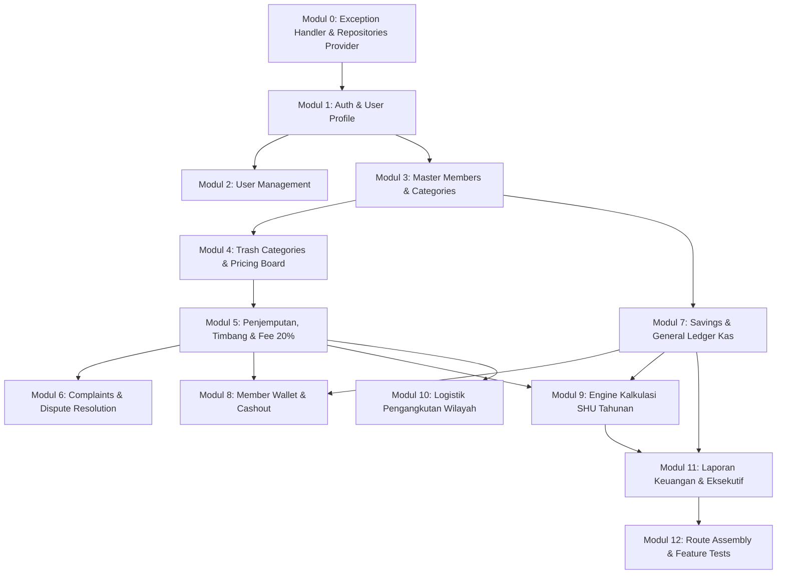

# BACKEND IMPLEMENTATION PLAN & TASK BREAKDOWN
## Sistem Informasi Koperasi & Bank Sampah "Koperasi Jasa Mulyo Raharjo Lestari"
**Arsitektur & Konvensi:** Mengikuti Standar [be-architecture.md](file:///c:/laragon/www/Koperasi-Jasa-Mulyo-Raharjo-Lestari/be-architecture.md)  
**Referensi Endpoint API:** [route-api.md](file:///c:/laragon/www/Koperasi-Jasa-Mulyo-Raharjo-Lestari/route-api.md)  
**Pola Desain:** Layered Architecture (Controller → Form Request → Service → Repository Interface/Eloquent → API Resource)  
**Versi:** 1.0.0  
**Tanggal:** 4 September 2026  

---

## 1. Ringkasan Prinsip Arsitektur & Standard Engineering Rules

Sesuai ketetapan di `be-architecture.md`, seluruh pekerjaan Backend wajib mematuhi batasan berikut:
1. **Scope Boundary**: BACKEND ONLY (RESTful API). Dilarang keras menggunakan Blade, session redirect, atau dependensi frontend.
2. **Thin Controller**: Controller hanya bertugas menerima HTTP Request, mendelegasikan ke Service via Dependency Injection, dan mengembalikan `JsonResponse` dengan HTTP Status Code yang tepat.
3. **Strict Validation**: Dilarang menggunakan `$request->validate()` di Controller. Seluruh validasi wajib melalui kelas `FormRequest` tersendiri di `app/Http/Requests/<Domain>/`.
4. **Service-Repository Pattern**:
   - Logika bisnis, kalkulasi potongan 20%, rumus SHU, dan transaksi `DB::transaction()` WAJIB berada di **Service Layer** (`app/Services/`).
   - Query ORM Eloquent diisolasi di **Repository Layer** dengan interface contract (`app/Repositories/Contracts/` dan `app/Repositories/Eloquent/`).
5. **API Resource/DTO Boundary**: Seluruh data keluar yang dikembalikan ke Client WAJIB melewati `JsonResource` (`app/Http/Resources/<Domain>/`) untuk menyembunyikan attribute internal sensitif.
6. **Global Exception Handling**: Seluruh penanganan error (401, 403, 404, 422, 500, dan Custom `BusinessLogicException`) dikelola tersentralisasi di `bootstrap/app.php`. Controller dilarang membungkus logic dengan `try-catch` berulang.

---

## 2. Struktur Direktori & Namespace Backend

```plaintext
app/
├── Exceptions/
│   └── BusinessLogicException.php
├── Http/
│   ├── Controllers/Api/v1/
│   │   ├── AuthController.php
│   │   ├── UserController.php
│   │   ├── MemberCategoryController.php
│   │   ├── MemberController.php
│   │   ├── TrashCategoryController.php
│   │   ├── PickupController.php
│   │   ├── ComplaintController.php
│   │   ├── FinanceCategoryController.php
│   │   ├── SavingsController.php
│   │   ├── TransactionController.php
│   │   ├── WalletController.php
│   │   ├── ShuController.php
│   │   ├── LogisticsController.php
│   │   └── ReportController.php
│   ├── Requests/
│   │   ├── Auth/
│   │   ├── User/
│   │   ├── Member/
│   │   ├── Trash/
│   │   ├── Pickup/
│   │   ├── Complaint/
│   │   ├── Finance/
│   │   ├── Savings/
│   │   ├── Wallet/
│   │   └── Shu/
│   └── Resources/
│       ├── User/
│       ├── Member/
│       ├── Trash/
│       ├── Pickup/
│       ├── Complaint/
│       ├── Finance/
│       ├── Savings/
│       ├── Wallet/
│       ├── Shu/
│       └── Report/
├── Services/
│   ├── AuthService.php
│   ├── UserService.php
│   ├── MemberService.php
│   ├── TrashCategoryService.php
│   ├── TrashWeighingService.php
│   ├── ComplaintService.php
│   ├── SavingsService.php
│   ├── TransactionService.php
│   ├── WalletService.php
│   ├── ShuCalculationEngine.php
│   ├── LogisticsService.php
│   └── ReportService.php
├── Repositories/
│   ├── Contracts/
│   │   ├── UserRepositoryInterface.php
│   │   ├── MemberRepositoryInterface.php
│   │   ├── TrashCategoryRepositoryInterface.php
│   │   ├── PickupRepositoryInterface.php
│   │   ├── ComplaintRepositoryInterface.php
│   │   ├── TransactionRepositoryInterface.php
│   │   ├── SetoranKoperasiRepositoryInterface.php
│   │   ├── ShuDistributionRepositoryInterface.php
│   │   └── DetailPengangkutanRepositoryInterface.php
│   └── Eloquent/
│       ├── UserRepository.php
│       ├── MemberRepository.php
│       ├── TrashCategoryRepository.php
│       ├── PickupRepository.php
│       ├── ComplaintRepository.php
│       ├── TransactionRepository.php
│       ├── SetoranKoperasiRepository.php
│       ├── ShuDistributionRepository.php
│       └── DetailPengangkutanRepository.php
└── Providers/
    └── RepositoryServiceProvider.php
```

---

## 3. Rincian Implementation Tasks per Modul

---

### MODUL 0: Core Setup, Exception Handler & Repository Provider
**Tujuan:** Membangun fondasi error handling tersentralisasi, exception bisnis, dan binding interface repository.

- [x] **Task 0.1: Global Exception Handler di `bootstrap/app.php`**
  - Mendaftarkan handler JSON untuk `ValidationException` (422), `NotFoundHttpException` (404), `AuthenticationException` (401), `MethodNotAllowedHttpException` (405), dan unhandled error (500).
- [x] **Task 0.2: Custom Exception `app/Exceptions/BusinessLogicException.php`**
  - Membuat custom exception yang dapat me-render response JSON otomatis dengan format standar error code 400.
- [x] **Task 0.3: Repository Service Provider `app/Providers/RepositoryServiceProvider.php`**
  - Mendaftarkan binding dari seluruh Contract Interface ke Eloquent Repository implementation.
  - Mendaftarkan provider di `bootstrap/providers.php`.
- [x] **Task 0.4: Konfigurasi CORS & Sanctum**
  - Konfigurasi `config/cors.php` agar menerima request dari domain client React (`localhost:5173` & staging domain).
  - Konfigurasi `config/sanctum.php` untuk personal access token.

---

### MODUL 1: Autentikasi & Akun Profil (`/api/v1/auth`)
**Endpoint:** `POST /auth/login`, `POST /auth/register-member`, `GET /auth/me`, `PUT /auth/profile`, `PUT /auth/change-password`, `POST /auth/logout`

- [x] **Task 1.1: Form Requests**
  - `app/Http/Requests/Auth/LoginRequest.php` (Validasi `identity`, `password`, `device_name`).
  - `app/Http/Requests/Auth/RegisterMemberRequest.php` (Validasi `name`, `username`, `email`, `password`, `phone`, `address`).
  - `app/Http/Requests/Auth/UpdateProfileRequest.php` (Validasi `name`, `phone`, `address`).
  - `app/Http/Requests/Auth/ChangePasswordRequest.php` (Validasi `current_password`, `new_password`, `new_password_confirmation`).
- [x] **Task 1.2: Repository Layer**
  - Interface: `app/Repositories/Contracts/UserRepositoryInterface.php`
    - Methods: `findByEmailOrUsername(string $identity)`, `create(array $data)`, `update(int $id, array $data)`, `findWithMember(int $id)`.
  - Implementasi: `app/Repositories/Eloquent/UserRepository.php`.
- [x] **Task 1.3: Service Layer (`app/Services/AuthService.php`)**
  - Method `authenticate(array $credentials, string $deviceName): array` (Validasi hash password, generate Sanctum token).
  - Method `registerMember(array $data): array` (Gunakan `DB::transaction()` untuk insert ke `users` dan `members` dengan status simpanan awal pending).
  - Method `changePassword(int $userId, string $currentPassword, string $newPassword): void`.
  - Method `logout(User $user): void` (Revoke token saat ini).
- [x] **Task 1.4: API Resource Layer**
  - `app/Http/Resources/User/UserResource.php` (Expose `id`, `name`, `username`, `email`, `role`, `created_at`; sembunyikan password/token internal).
  - `app/Http/Resources/User/AuthTokenResource.php` (Expose `token`, `user`).
- [x] **Task 1.5: Controller Layer (`app/Http/Controllers/Api/v1/AuthController.php`)**
  - Implementasi method `login`, `registerMember`, `me`, `updateProfile`, `changePassword`, `logout` dengan status HTTP 200/201.

---

### MODUL 2: Manajemen Pengguna & Hak Akses (`/api/v1/users`)
**Endpoint:** `GET /users`, `POST /users`, `GET /users/{id}`, `PUT /users/{id}`, `DELETE /users/{id}`

- [x] **Task 2.1: Form Requests**
  - `app/Http/Requests/User/CreateUserRequest.php` (Validasi role: `ketua`, `pengurus`, `petugas`).
  - `app/Http/Requests/User/UpdateUserRequest.php` (Validasi unique email/username ignore self).
- [x] **Task 2.2: Service Layer (`app/Services/UserService.php`)**
  - Method `getUsersPaginated(array $filters): LengthAwarePaginator`.
  - Method `createUser(array $data): User`.
  - Method `updateUser(int $id, array $data): User`.
  - Method `deleteUser(int $id): bool`.
- [x] **Task 2.3: API Resource Layer**
  - `app/Http/Resources/User/UserCollection.php`.
- [x] **Task 2.4: Controller Layer (`app/Http/Controllers/Api/v1/UserController.php`)**
  - Proteksi middleware role `role:ketua,pengurus`.

---

### MODUL 3: Master Data Keanggotaan (`/api/v1/members` & `/api/v1/member-categories`)
**Endpoint:** `GET/POST /member-categories`, `GET/POST /members`, `GET/PUT /members/{id}`, `PATCH /members/{id}/status`

- [x] **Task 3.1: Form Requests**
  - `app/Http/Requests/Member/StoreMemberCategoryRequest.php`.
  - `app/Http/Requests/Member/StoreMemberRequest.php`.
  - `app/Http/Requests/Member/UpdateMemberRequest.php`.
  - `app/Http/Requests/Member/UpdateMemberStatusRequest.php` (Enum: `aktif`, `nonaktif`, `suspend`).
- [x] **Task 3.2: Repository Layer**
  - Interface: `app/Repositories/Contracts/MemberRepositoryInterface.php`
    - Methods: `paginate(array $filters)`, `findById(int $id)`, `create(array $data)`, `update(int $id, array $data)`, `generateMemberCode(): string`.
  - Implementasi: `app/Repositories/Eloquent/MemberRepository.php`.
- [x] **Task 3.3: Service Layer (`app/Services/MemberService.php`)**
  - Method `createMember(array $data): Member` (Otomasi format kode anggota `MBR-YYYYMM-XXXX` via generator).
  - Method `updateStatus(int $id, string $status, ?string $notes): Member`.
- [x] **Task 3.4: API Resource Layer**
  - `app/Http/Resources/Member/MemberResource.php` (Include data kategori, total saldo, tanggal bergabung).
  - `app/Http/Resources/Member/MemberCategoryResource.php`.
- [x] **Task 3.5: Controller Layer**
  - `app/Http/Controllers/Api/v1/MemberCategoryController.php`.
  - `app/Http/Controllers/Api/v1/MemberController.php`.

---

### MODUL 4: Katalog Sampah & Manajemen Harga (`/api/v1/trash-categories`)
**Endpoint:** `GET /trash-categories`, `GET /trash-categories/board`, `POST /trash-categories`, `GET/PUT /trash-categories/{id}`, `PATCH /trash-categories/{id}/price`, `GET /trash-categories/{id}/price-history`

- [x] **Task 4.1: Form Requests**
  - `app/Http/Requests/Trash/StoreTrashCategoryRequest.php` (Validasi unit `kg`/`biji`, harga terpilah & tidak terpilah).
  - `app/Http/Requests/Trash/UpdateTrashPriceRequest.php` (Validasi perubahan harga harian & catatan alasan).
- [x] **Task 4.2: Repository Layer**
  - Interface: `app/Repositories/Contracts/TrashCategoryRepositoryInterface.php`
    - Methods: `getAllActive()`, `getPriceBoardData()`, `updatePriceWithAudit(int $id, array $priceData, int $userId)`.
  - Implementasi: `app/Repositories/Eloquent/TrashCategoryRepository.php`.
- [x] **Task 4.3: Service Layer (`app/Services/TrashCategoryService.php`)**
  - Method `updateDailyPrice(int $id, array $data, User $actor): TrashCategory` (Menggunakan `DB::transaction()` untuk update tabel master dan mencatat ke tabel histori perubahan harga).
  - Method `getPriceBoard(): Collection` (Menyusun data perbandingan harga jemput vs gudang dengan diskon logam Rp2.000 dan non-logam Rp300).
- [x] **Task 4.4: API Resource Layer**
  - `app/Http/Resources/Trash/TrashCategoryResource.php`.
  - `app/Http/Resources/Trash/TrashPriceBoardResource.php` (Menyertakan perhitungan tarif antar vs jemput).
  - `app/Http/Resources/Trash/PriceHistoryResource.php`.
- [x] **Task 4.5: Controller Layer (`app/Http/Controllers/Api/v1/TrashCategoryController.php`)**

---

### MODUL 5: Operasional Bank Sampah: Penjemputan & Timbang (`/api/v1/pickups`)
**Endpoint:** `GET /pickups`, `POST /pickups`, `POST /pickups/{id}/weigh-items`, `GET /pickups/{id}`, `GET /pickups/{id}/receipt`, `PATCH /pickups/{id}/cancel`

- [ ] **Task 5.1: Form Requests**
  - `app/Http/Requests/Pickup/CreatePickupTicketRequest.php` (Validasi `member_id`, `scheduled_at`, `location_type`).
  - `app/Http/Requests/Pickup/SubmitWeighItemsRequest.php` (Validasi array `items.*.category_id`, `items.*.weight_kg`, `items.*.unit_count`).
- [ ] **Task 5.2: Repository Layer**
  - Interface: `app/Repositories/Contracts/PickupRepositoryInterface.php`
    - Methods: `paginate(array $filters)`, `findByIdWithDetails(int $id)`, `createHeader(array $data)`, `addItemsAndComplete(int $id, array $items, float $totalGross, float $totalFee, float $totalNet)`.
  - Implementasi: `app/Repositories/Eloquent/PickupRepository.php`.
- [ ] **Task 5.3: Service Layer (`app/Services/TrashWeighingService.php`)**
  - Core Business Engine:
    - Menghitung nilai bruto per baris item sesuai tarif hari ini dan lokasi (jemput vs antar).
    - Menghitung potongan **20% biaya operasional koperasi**.
    - Menghitung nilai bersih yang didapat anggota (80%).
    - Menjalankan `DB::transaction()`:
      1. Simpan baris rincian di `pickup_items`.
      2. Update status `pickups` menjadi `selesai` dan catat `completed_at`.
      3. Insert mutasi pemasukan kas di `transactions` untuk potongan 20% koperasi.
      4. Kreditkan saldo dompet anggota secara instan (*real-time balance update*).
  - Method `cancelTransaction(int $id, string $reason): void` (Rollback saldo dan pembatalan transaksi).
- [ ] **Task 5.4: API Resource Layer**
  - `app/Http/Resources/Pickup/PickupResource.php`.
  - `app/Http/Resources/Pickup/ReceiptResource.php` (Format nota digital: QR verifikasi, detail berat, potongan 20%, saldo masuk).
- [ ] **Task 5.5: Controller Layer (`app/Http/Controllers/Api/v1/PickupController.php`)**

---

### MODUL 6: Pengaduan & Komplain Transaksi (`/api/v1/complaints`)
**Endpoint:** `GET /complaints`, `POST /complaints`, `GET /complaints/{id}`, `PATCH /complaints/{id}/resolve`

- [ ] **Task 6.1: Form Requests**
  - `app/Http/Requests/Complaint/SubmitComplaintRequest.php` (Validasi `pickup_id`, `issue_type`, `description`, upload `proof_image`).
  - `app/Http/Requests/Complaint/ResolveComplaintRequest.php` (Validasi status `diterima`/`ditolak`, `adjustment_amount`, `resolution_note`).
- [ ] **Task 6.2: Repository Layer**
  - Interface: `app/Repositories/Contracts/ComplaintRepositoryInterface.php`.
  - Implementasi: `app/Repositories/Eloquent/ComplaintRepository.php`.
- [ ] **Task 6.3: Service Layer (`app/Services/ComplaintService.php`)**
  - Method `submitComplaint(User $member, array $data): Complaint` (Validasi batas waktu komplain maksimal 3x24 jam dari nota timbang).
  - Method `resolveComplaint(int $complaintId, array $resolutionData, User $resolver): Complaint` (Jika disetujui: `DB::transaction()` untuk mencatat transaksi penyesuaian kas dan rekalkulasi saldo anggota).
- [ ] **Task 6.4: API Resource Layer**
  - `app/Http/Resources/Complaint/ComplaintResource.php`.
- [ ] **Task 6.5: Controller Layer (`app/Http/Controllers/Api/v1/ComplaintController.php`)**

---

### MODUL 7: Keuangan Koperasi, Simpanan & Billing Rutin (`/api/v1/savings` & `/api/v1/transactions`)
**Endpoint:** `GET/POST /finance-categories`, `GET /savings`, `POST /savings/pay`, `GET /savings/billing-status`, `POST /savings/generate-monthly-billing`, `GET/POST /transactions`

- [ ] **Task 7.1: Form Requests**
  - `app/Http/Requests/Savings/PaySavingsRequest.php` (Validasi label: `POKOK`, `WAJIB`, `TIPPING`, `SUKARELA`).
  - `app/Http/Requests/Finance/CreateTransactionRequest.php` (Validasi `type: income/expense`, `amount`, `payment_method`).
- [ ] **Task 7.2: Repository Layer**
  - Interface: `app/Repositories/Contracts/SetoranKoperasiRepositoryInterface.php`.
  - Interface: `app/Repositories/Contracts/TransactionRepositoryInterface.php`.
  - Implementasi di `app/Repositories/Eloquent/`.
- [ ] **Task 7.3: Service Layer (`app/Services/SavingsService.php` & `TransactionService.php`)**
  - Method `recordSavingsPayment(array $data, User $handler): SetoranKoperasi` (Simpan setoran & catat jurnal buku kas di `transactions`).
  - Method `generateMonthlyBilling(): array` (Kalkulasi tagihan bulanan Rp45.000: Simpanan Wajib Rp5.000 + Tipping Fee Rp40.000 untuk seluruh anggota aktif).
  - Method `getBillingStatus(int $memberId): array` (Cek tunggakan atau status lunas bulan berjalan).
- [ ] **Task 7.4: API Resource Layer**
  - `app/Http/Resources/Savings/SavingsResource.php`.
  - `app/Http/Resources/Finance/TransactionResource.php`.
- [ ] **Task 7.5: Controller Layer**
  - `app/Http/Controllers/Api/v1/SavingsController.php`.
  - `app/Http/Controllers/Api/v1/TransactionController.php`.
  - `app/Http/Controllers/Api/v1/FinanceCategoryController.php`.

---

### MODUL 8: Dompet Saldo Anggota & Penarikan Tunai (`/api/v1/wallet`)
**Endpoint:** `GET /wallet/summary`, `GET /wallet/mutations`, `POST /wallet/withdraw`, `GET /wallet/withdraw-requests`, `PATCH /wallet/withdraw-requests/{id}/approve`

- [ ] **Task 8.1: Form Requests**
  - `app/Http/Requests/Wallet/WithdrawRequest.php` (Validasi `amount`, `method`, detail rekening/e-wallet).
  - `app/Http/Requests/Wallet/ApproveWithdrawRequest.php` (Validasi action `approve`/`reject`, bukti transfer).
- [ ] **Task 8.2: Service Layer (`app/Services/WalletService.php`)**
  - Method `getMemberWalletSummary(int $memberId): array` (Agregasi saldo masuk dari sampah & dividen SHU dikurangi penarikan).
  - Method `requestWithdraw(User $member, array $data): WithdrawRequest` (Validasi saldo mencukupi, jika kurang lempar `BusinessLogicException`).
  - Method `processWithdrawApproval(int $requestId, array $approvalData, User $approver): void` (Eksekusi penarikan dalam `DB::transaction()`: potong saldo mengendap, catat pengeluaran kas).
- [ ] **Task 8.3: API Resource Layer**
  - `app/Http/Resources/Wallet/WalletSummaryResource.php`.
  - `app/Http/Resources/Wallet/WalletMutationResource.php`.
  - `app/Http/Resources/Wallet/WithdrawRequestResource.php`.
- [ ] **Task 8.4: Controller Layer (`app/Http/Controllers/Api/v1/WalletController.php`)**

---

### MODUL 9: Mesin Kalkulasi & Pembagian SHU Tahunan (`/api/v1/shu`)
**Endpoint:** `GET /shu/periods`, `POST /shu/simulate`, `POST /shu/publish`, `GET /shu/my-history`

- [ ] **Task 9.1: Form Requests**
  - `app/Http/Requests/Shu/SimulateShuRequest.php` (Validasi `year`, `net_profit`, `shu_pool_percentage: 20`).
  - `app/Http/Requests/Shu/PublishShuRequest.php` (Validasi `shu_distribution_id`).
- [ ] **Task 9.2: Repository Layer**
  - Interface: `app/Repositories/Contracts/ShuDistributionRepositoryInterface.php`.
  - Implementasi: `app/Repositories/Eloquent/ShuDistributionRepository.php`.
- [ ] **Task 9.3: Service Layer (`app/Services/ShuCalculationEngine.php`)**
  - Method `simulateDistribution(int $year, float $netProfit, float $poolPercentage): array`
    - Rumus alokasi: Pool SHU 20% dari laba bersih.
    - Pembagian proporsional: Jasa Modal (Simpanan Pokok + Wajib + Sukarela) dan Jasa Partisipasi Transaksi (Volume setoran sampah).
  - Method `publishDistribution(int $distributionId, User $authorizer): ShuDistribution`
    - Eksekusi massal dalam `DB::transaction()`:
      1. Kunci status distribusi menjadi `dibagikan`.
      2. Buat record di `shu_members`.
      3. Top-up saldo dompet ke masing-masing anggota secara instan.
      4. Catat pengeluaran kas dividen koperasi di `transactions`.
- [ ] **Task 9.4: API Resource Layer**
  - `app/Http/Resources/Shu/ShuPeriodResource.php`.
  - `app/Http/Resources/Shu/ShuSimulationResource.php`.
  - `app/Http/Resources/Shu/ShuMemberHistoryResource.php`.
- [ ] **Task 9.5: Controller Layer (`app/Http/Controllers/Api/v1/ShuController.php`)**

---

### MODUL 10: Logistik Wilayah & Rekapitulasi Pengangkutan (`/api/v1/logistics`)
**Endpoint:** `GET/POST /logistics/routes`

- [ ] **Task 10.1: Form Requests**
  - `app/Http/Requests/Logistics/StoreLogisticsRouteRequest.php`.
- [ ] **Task 10.2: Service Layer (`app/Services/LogisticsService.php`)**
- [ ] **Task 10.3: API Resource Layer**
  - `app/Http/Resources/Logistics/LogisticsRouteResource.php`.
- [ ] **Task 10.4: Controller Layer (`app/Http/Controllers/Api/v1/LogisticsController.php`)**

---

### MODUL 11: Laporan Eksekutif & Analitik (`/api/v1/reports`)
**Endpoint:** `GET /reports/dashboard-stats`, `GET /reports/financial`, `GET /reports/trash-volume`, `GET /reports/export`

- [ ] **Task 11.1: Service Layer (`app/Services/ReportService.php`)**
  - Method `getDashboardStats(): array` (Total Kas, Volume Sampah Bulan Ini, Jumlah Anggota Aktif).
  - Method `getFinancialReport(string $start, string $end): array` (Neraca & Laba Rugi).
  - Method `getTrashVolumeReport(array $filters): array` (Rekapitulasi tonase per wilayah/kategori).
  - Method `exportReport(int $reportId, string $format): BinaryFileResponse` (Stream download PDF/Excel).
- [ ] **Task 11.2: API Resource Layer**
  - `app/Http/Resources/Report/DashboardStatsResource.php`.
  - `app/Http/Resources/Report/FinancialReportResource.php`.
- [ ] **Task 11.3: Controller Layer (`app/Http/Controllers/Api/v1/ReportController.php`)**

---

### MODUL 12: Automated Feature Testing & Route Assembly (`routes/api.php`)

- [ ] **Task 12.1: Assembling `routes/api.php`**
  - Mendaftarkan seluruh route dengan prefix `v1/`, grouping middleware `auth:sanctum`, dan role protection.
- [ ] **Task 12.2: Feature Tests (PHPUnit)**
  - `tests/Feature/Api/AuthTest.php`: Login, token emission, invalid credential 422, unauthenticated 401.
  - `tests/Feature/Api/TrashWeighingTest.php`: Alur timbang lapangan → verifikasi kalkulasi potongan 20% → verifikasi saldo anggota bertambah.
  - `tests/Feature/Api/SavingsBillingTest.php`: Verifikasi tagihan bulanan Rp45.000 & pencatatan simpanan.
  - `tests/Feature/Api/ShuDistributionTest.php`: Simulasi SHU & eksekusi pembagian saldo massal.
  - `tests/Feature/Api/GlobalExceptionHandlerTest.php`: Verifikasi seluruh error response 404, 422, 500 berformat JSON standar sesuai arsitektur.

---

## 4. Matriks Dependensi & Urutan Eksekusi



Seluruh task di atas telah diuraikan per layer teknis (*Controller, FormRequest, Service, Repository, Resource*) untuk memastikan tidak ada pelanggaran aturan `be-architecture.md` dan siap dikerjakan oleh Tim Backend.
